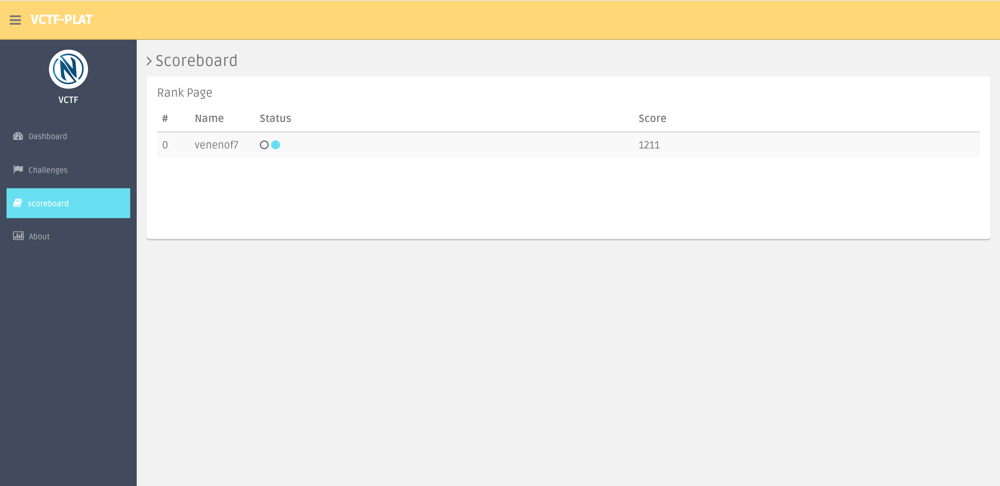
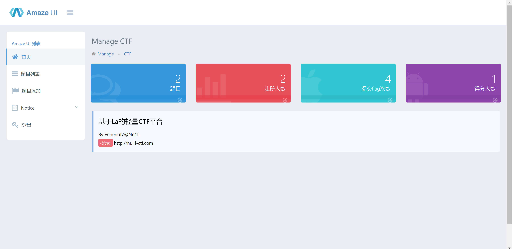

<h1 align="center">VCTF-Platform🚩</h1>


## ♻ About VCTF-Plaform

```php
Ubuntu16.04+Laravel+Mysql+Nginx

Maybe some bugs:(I'll update
```

## 😋 How to use

1. Route
```php
Route::get('challenges','ctfController@challenges');
Route::get('scoreboard','ctfController@score');
Route::post('flag/submit','ctfController@submitflag');
/*
admin
*/
Route::get('ctfadmin/task','adminController@seetask');
Route::any('ctfadmin/task/add','adminController@addtask');
Route::get('ctfadmin/home','adminController@index');
Route::any('ctfadmin/task/hint','adminController@hintadd');

Auth::routes();

Route::get('/home', 'ctfController@index');
Route::get('/about','ctfController@about');
```

2. Run it

```bash
>mysql pass is root(or vim .env)

>git clone https://github.com/Veneno0/VCTF-Platform.git

>cd VCTF-Platform

>cp .env.example .env

>php artisan key:generate

>php artisan serve

>mysql -uroot -p ctf < ctf.sql

>composer install

>php artisan serve --host=0.0.0.0

>http://yourip:8000/ 

>play ctf:)
```
## 👨‍💻 Contact me

`nul1ctf[at]163.com`

## photo





